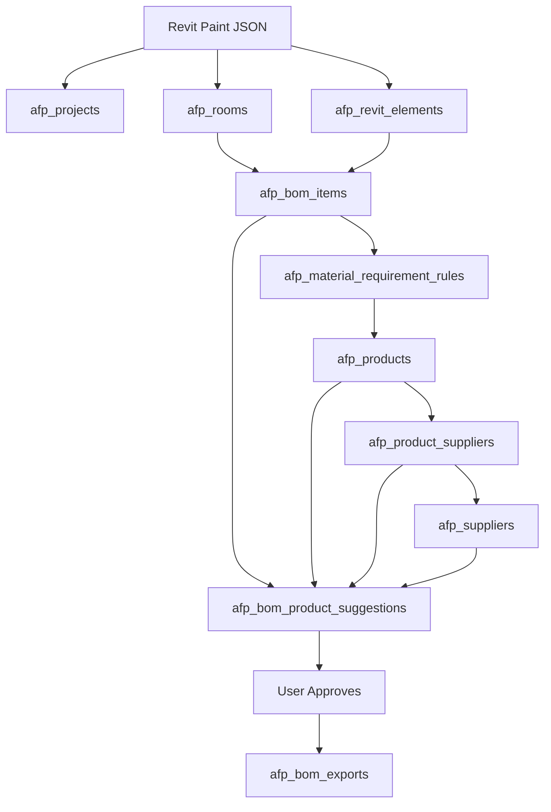

# AFP Paint Suggestion App — Rebuild Guide

Frontend: **Next.js + TypeScript + Tailwind + shadcn/ui**  
Backend: **FastAPI**  
Database: **Supabase PostgreSQL**

Goal:

```text
Upload Revit Paint JSON
→ create project / rooms / paint surfaces
→ generate paint BOM
→ suggest paint products
→ approve products
→ export BOM
```

---

## 1. Correct architecture

### Revit JSON responsibility

Revit JSON should contain only building and paint-area data:

```text
project
rooms
rooms[].surfaces
rooms[].requirements
exterior
```

Do not put product logic in Revit JSON:

```text
No RequiredProductType
No CandidateProductSkus
No product ranking
No supplier ranking
No final score
```

### Backend responsibility

FastAPI handles all business logic:

```text
import JSON
create BOM
build product requirement
filter products
rank suppliers
save suggestions
approve products
export BOM
```

### Frontend responsibility

Next.js handles workflow review:

```text
Dashboard
Import JSON
Review rooms
Review BOM
Review suggestions
Approve
Export
```

### Supabase responsibility

Supabase stores:

```text
projects
rooms
paint elements
BOM items
rules
products
suppliers
prices
suggestions
exports
```

---

## 2. Full app workflow

```text
1. User uploads Revit paint JSON
2. Backend creates project
3. Backend imports rooms
4. Backend imports paint surfaces
5. Backend generates paint BOM items
6. Backend builds product requirements using rules
7. Backend filters paint products
8. Backend checks supplier price / stock / delivery
9. Backend ranks suggestions
10. Frontend shows suggestions
11. User approves product
12. Backend exports final BOM
```

---

## 3. Database flowchart



---

## 4. Tables

### 4.1 `afp_projects`

Stores one imported Revit project.

Important columns:

```text
id
project_code
project_name
revit_file_name
location
exported_by
export_date
unit_system
source_type
status
created_at
updated_at
```

---

### 4.2 `afp_rooms`

Stores room information from JSON.

Important columns:

```text
id
project_id
level_id
room_code
revit_room_id
room_number
room_name
room_type
level_name
area_m2
perimeter_m
height_m
requirements
source_payload
created_at
updated_at
```

---

### 4.3 `afp_revit_elements`

Stores paintable surfaces only.

Important columns:

```text
id
project_id
room_id
revit_element_id
revit_unique_id
category
built_in_category
class_name
surface
material_name
material_class
substrate
condition
finish_type
gross_area_m2
opening_area_m2
net_area_m2
source_payload
created_at
updated_at
```

Example records:

```text
Living Room wall
Living Room ceiling
Bathroom wall
Exterior facade
Feature wall
```

---

### 4.4 `afp_bom_items`

Stores calculated paint BOM items.

Important columns:

```text
id
project_id
room_id
revit_element_id
bom_code
item_name
category
surface
material_name
finish_type
substrate
condition
quantity
unit
gross_area_m2
opening_area_m2
net_area_m2
waste_factor
formula_type
requirement_status
suggestion_status
created_at
updated_at
```

Formula:

```text
quantity = net_area_m2 × waste_factor
```

---

### 4.5 `afp_material_requirement_rules`

Stores backend rules that convert BOM item into product requirement.

Important columns:

```text
id
rule_code
bom_category
room_type
surface
finish_type
substrate
condition
required_product_type
usage_area
required_features
preferred_features
waste_factor
priority
description
is_active
created_at
updated_at
```

Example:

```text
Bathroom + wall + interior_paint
→ waterproofing_paint
→ required_features = ["waterproof"]
```

---

### 4.6 `afp_products`

Stores Paint & More product catalog.

Important columns:

```text
id
sku
product_name
brand
raw_category
category
product_type
usage_areas
features
surface_types
finish_options
sheen
color_range
voc_level
coverage_m2_per_liter
package_size
package_unit
description
source_url
status
created_at
updated_at
```

---

### 4.7 `afp_suppliers`

Stores supplier data.

Important columns:

```text
id
supplier_code
supplier_name
short_name
phone
email
website
address
city
rating
is_active
source_note
created_at
updated_at
```

---

### 4.8 `afp_product_suppliers`

Stores price / stock / delivery per product and supplier.

Important columns:

```text
id
product_id
supplier_id
unit_price
currency
price_status
stock_qty
min_order_qty
delivery_days
is_available
source_url
note
created_at
updated_at
```

Recommended unique key:

```sql
UNIQUE(product_id, supplier_id)
```

---

### 4.9 `afp_bom_product_suggestions`

Stores ranked product suggestions.

Important columns:

```text
id
bom_item_id
product_id
supplier_id
product_supplier_id
rank_no
is_best_option
hard_filter_pass
required_match
preferred_match
rejected_reasons
feature_score
price_score
stock_score
delivery_score
supplier_score
final_score
estimated_required_package_qty
estimated_total_cost
currency
suggestion_status
approved_by
approved_at
note
created_at
updated_at
```

---

### 4.10 `afp_bom_exports`

Stores export history.

Important columns:

```text
id
project_id
export_code
export_type
export_scope
file_name
file_url
total_items
total_estimated_cost
currency
export_status
exported_by
exported_at
note
created_at
```

---

## 5. Supabase SQL schema

Use this minimal schema to rebuild the database.

```sql
CREATE TABLE IF NOT EXISTS afp_projects (
  id BIGSERIAL PRIMARY KEY,
  project_code TEXT UNIQUE NOT NULL,
  project_name TEXT NOT NULL,
  revit_file_name TEXT,
  location TEXT,
  exported_by TEXT,
  export_date DATE,
  unit_system TEXT DEFAULT 'metric',
  source_type TEXT DEFAULT 'revit_json',
  status TEXT DEFAULT 'imported',
  created_at TIMESTAMP DEFAULT NOW(),
  updated_at TIMESTAMP DEFAULT NOW()
);

CREATE TABLE IF NOT EXISTS afp_rooms (
  id BIGSERIAL PRIMARY KEY,
  project_id BIGINT REFERENCES afp_projects(id) ON DELETE CASCADE,
  room_code TEXT,
  revit_room_id TEXT,
  room_number TEXT,
  room_name TEXT NOT NULL,
  room_type TEXT,
  level_name TEXT,
  area_m2 NUMERIC,
  perimeter_m NUMERIC,
  height_m NUMERIC,
  requirements JSONB DEFAULT '{}'::jsonb,
  source_payload JSONB DEFAULT '{}'::jsonb,
  created_at TIMESTAMP DEFAULT NOW(),
  updated_at TIMESTAMP DEFAULT NOW()
);

CREATE TABLE IF NOT EXISTS afp_revit_elements (
  id BIGSERIAL PRIMARY KEY,
  project_id BIGINT REFERENCES afp_projects(id) ON DELETE CASCADE,
  room_id BIGINT REFERENCES afp_rooms(id) ON DELETE SET NULL,
  revit_element_id TEXT,
  revit_unique_id TEXT,
  category TEXT DEFAULT 'Paint',
  built_in_category TEXT,
  class_name TEXT,
  surface TEXT NOT NULL,
  material_name TEXT,
  material_class TEXT DEFAULT 'Paint',
  substrate TEXT,
  condition TEXT,
  finish_type TEXT,
  gross_area_m2 NUMERIC,
  opening_area_m2 NUMERIC DEFAULT 0,
  net_area_m2 NUMERIC,
  source_payload JSONB DEFAULT '{}'::jsonb,
  created_at TIMESTAMP DEFAULT NOW(),
  updated_at TIMESTAMP DEFAULT NOW()
);

CREATE TABLE IF NOT EXISTS afp_bom_items (
  id BIGSERIAL PRIMARY KEY,
  project_id BIGINT REFERENCES afp_projects(id) ON DELETE CASCADE,
  room_id BIGINT REFERENCES afp_rooms(id) ON DELETE SET NULL,
  revit_element_id BIGINT REFERENCES afp_revit_elements(id) ON DELETE SET NULL,
  bom_code TEXT UNIQUE NOT NULL,
  item_name TEXT NOT NULL,
  category TEXT DEFAULT 'Paint',
  surface TEXT,
  material_name TEXT,
  finish_type TEXT,
  substrate TEXT,
  condition TEXT,
  quantity NUMERIC NOT NULL,
  unit TEXT DEFAULT 'm2',
  gross_area_m2 NUMERIC,
  opening_area_m2 NUMERIC,
  net_area_m2 NUMERIC,
  waste_factor NUMERIC DEFAULT 1.10,
  formula_type TEXT,
  formula_note TEXT,
  requirement_status TEXT DEFAULT 'pending',
  suggestion_status TEXT DEFAULT 'pending',
  created_at TIMESTAMP DEFAULT NOW(),
  updated_at TIMESTAMP DEFAULT NOW()
);

CREATE TABLE IF NOT EXISTS afp_material_requirement_rules (
  id BIGSERIAL PRIMARY KEY,
  rule_code TEXT UNIQUE NOT NULL,
  bom_category TEXT DEFAULT 'Paint',
  room_type TEXT DEFAULT 'Any',
  surface TEXT DEFAULT 'Any',
  finish_type TEXT DEFAULT 'Any',
  substrate TEXT DEFAULT 'Any',
  condition TEXT DEFAULT 'Any',
  required_product_type TEXT NOT NULL,
  usage_area TEXT NOT NULL,
  required_features JSONB DEFAULT '[]'::jsonb,
  preferred_features JSONB DEFAULT '[]'::jsonb,
  waste_factor NUMERIC DEFAULT 1.10,
  priority INT DEFAULT 1,
  description TEXT,
  is_active BOOLEAN DEFAULT TRUE,
  created_at TIMESTAMP DEFAULT NOW(),
  updated_at TIMESTAMP DEFAULT NOW()
);

CREATE TABLE IF NOT EXISTS afp_products (
  id BIGSERIAL PRIMARY KEY,
  sku TEXT UNIQUE NOT NULL,
  product_name TEXT NOT NULL,
  brand TEXT,
  raw_category TEXT,
  category TEXT DEFAULT 'Paint',
  product_type TEXT,
  usage_areas JSONB DEFAULT '[]'::jsonb,
  features JSONB DEFAULT '[]'::jsonb,
  surface_types JSONB DEFAULT '[]'::jsonb,
  finish_options JSONB DEFAULT '[]'::jsonb,
  sheen TEXT,
  color_range TEXT,
  voc_level TEXT,
  coverage_m2_per_liter NUMERIC,
  package_size NUMERIC,
  package_unit TEXT,
  volume_status TEXT,
  description TEXT,
  source_url TEXT,
  status TEXT DEFAULT 'active',
  created_at TIMESTAMP DEFAULT NOW(),
  updated_at TIMESTAMP DEFAULT NOW()
);

CREATE TABLE IF NOT EXISTS afp_suppliers (
  id BIGSERIAL PRIMARY KEY,
  supplier_code TEXT UNIQUE NOT NULL,
  supplier_name TEXT NOT NULL,
  short_name TEXT,
  phone TEXT,
  email TEXT,
  website TEXT,
  address TEXT,
  city TEXT,
  rating NUMERIC DEFAULT 0,
  is_active BOOLEAN DEFAULT TRUE,
  source_note TEXT,
  created_at TIMESTAMP DEFAULT NOW(),
  updated_at TIMESTAMP DEFAULT NOW()
);

CREATE TABLE IF NOT EXISTS afp_product_suppliers (
  id BIGSERIAL PRIMARY KEY,
  product_id BIGINT REFERENCES afp_products(id) ON DELETE CASCADE,
  supplier_id BIGINT REFERENCES afp_suppliers(id) ON DELETE CASCADE,
  unit_price NUMERIC,
  currency TEXT DEFAULT 'VND',
  price_status TEXT DEFAULT 'contact_for_price',
  stock_qty NUMERIC,
  min_order_qty NUMERIC DEFAULT 1,
  delivery_days INT,
  is_available BOOLEAN DEFAULT TRUE,
  source_url TEXT,
  note TEXT,
  created_at TIMESTAMP DEFAULT NOW(),
  updated_at TIMESTAMP DEFAULT NOW(),
  UNIQUE(product_id, supplier_id)
);

CREATE TABLE IF NOT EXISTS afp_bom_product_suggestions (
  id BIGSERIAL PRIMARY KEY,
  bom_item_id BIGINT REFERENCES afp_bom_items(id) ON DELETE CASCADE,
  product_id BIGINT REFERENCES afp_products(id) ON DELETE CASCADE,
  supplier_id BIGINT REFERENCES afp_suppliers(id) ON DELETE CASCADE,
  product_supplier_id BIGINT REFERENCES afp_product_suppliers(id) ON DELETE CASCADE,
  rank_no INT,
  is_best_option BOOLEAN DEFAULT FALSE,
  hard_filter_pass BOOLEAN DEFAULT TRUE,
  required_match JSONB DEFAULT '{}'::jsonb,
  preferred_match JSONB DEFAULT '{}'::jsonb,
  rejected_reasons JSONB DEFAULT '[]'::jsonb,
  feature_score NUMERIC DEFAULT 0,
  price_score NUMERIC DEFAULT 0,
  stock_score NUMERIC DEFAULT 0,
  delivery_score NUMERIC DEFAULT 0,
  supplier_score NUMERIC DEFAULT 0,
  final_score NUMERIC DEFAULT 0,
  estimated_required_package_qty NUMERIC,
  estimated_total_cost NUMERIC,
  currency TEXT DEFAULT 'VND',
  suggestion_status TEXT DEFAULT 'suggested',
  approved_by TEXT,
  approved_at TIMESTAMP,
  note TEXT,
  created_at TIMESTAMP DEFAULT NOW(),
  updated_at TIMESTAMP DEFAULT NOW()
);

CREATE TABLE IF NOT EXISTS afp_bom_exports (
  id BIGSERIAL PRIMARY KEY,
  project_id BIGINT REFERENCES afp_projects(id) ON DELETE CASCADE,
  export_code TEXT UNIQUE NOT NULL,
  export_type TEXT DEFAULT 'excel',
  export_scope TEXT DEFAULT 'approved_only',
  file_name TEXT,
  file_url TEXT,
  total_items INT,
  total_estimated_cost NUMERIC,
  currency TEXT DEFAULT 'VND',
  export_status TEXT DEFAULT 'created',
  exported_by TEXT,
  exported_at TIMESTAMP DEFAULT NOW(),
  note TEXT,
  created_at TIMESTAMP DEFAULT NOW()
);
```

---

## 6. Seed material rules

```sql
INSERT INTO afp_material_requirement_rules (
  rule_code,
  bom_category,
  room_type,
  surface,
  finish_type,
  required_product_type,
  usage_area,
  required_features,
  preferred_features,
  priority,
  description
)
VALUES
(
  'RULE_BATHROOM_WALL_WATERPROOF',
  'Paint',
  'Bathroom',
  'wall',
  'interior_paint',
  'waterproofing_paint',
  'wet_area_wall',
  '["waterproof"]',
  '["moisture_resistant", "mold_resistant"]',
  100,
  'Bathroom wall requires waterproof paint'
),
(
  'RULE_KITCHEN_WALL_WASHABLE',
  'Paint',
  'Kitchen',
  'wall',
  'interior_paint',
  'interior_wall_paint',
  'interior_wall',
  '["interior"]',
  '["washable", "easy_clean", "stain_resistant"]',
  90,
  'Kitchen wall should use washable interior paint'
),
(
  'RULE_EXTERIOR_FACADE',
  'Paint',
  'Exterior',
  'exterior',
  'exterior_paint',
  'exterior_wall_paint',
  'exterior_wall',
  '["weather_resistant"]',
  '["uv_resistant", "waterproof"]',
  100,
  'Exterior facade requires weather-resistant exterior paint'
),
(
  'RULE_CEILING_INTERIOR',
  'Paint',
  'Any',
  'ceiling',
  'interior_paint',
  'wall_paint',
  'ceiling',
  '[]',
  '["matte", "low_splash"]',
  60,
  'Interior ceiling paint rule'
),
(
  'RULE_INTERIOR_WALL_DEFAULT',
  'Paint',
  'Any',
  'wall',
  'interior_paint',
  'interior_wall_paint',
  'interior_wall',
  '["interior"]',
  '["washable", "low_odor"]',
  50,
  'Default interior wall paint rule'
);
```

---

## 7. Supabase setup

### 7.1 Create project

1. Open Supabase.
2. Create new project.
3. Open SQL Editor.
4. Run schema SQL.
5. Run product seed SQL.
6. Run supplier/price seed SQL.
7. Run rule seed SQL.

### 7.2 Backend `.env`

```env
SUPABASE_URL=https://your-project.supabase.co
SUPABASE_SERVICE_ROLE_KEY=your-service-role-key
SUPABASE_BUCKET=exports
```

Important:

```text
SUPABASE_SERVICE_ROLE_KEY must stay in backend only.
Never put it in frontend.
```

### 7.3 Frontend `.env.local`

```env
NEXT_PUBLIC_API_URL=http://localhost:8000
NEXT_PUBLIC_SUPABASE_URL=https://your-project.supabase.co
NEXT_PUBLIC_SUPABASE_ANON_KEY=your-anon-key
```

---

## 8. Backend setup

```bash
mkdir backend
cd backend
python -m venv .venv
.venv\Scriptsctivate
pip install fastapi uvicorn python-dotenv supabase pydantic pydantic-settings pandas openpyxl
```

Create `requirements.txt`:

```txt
fastapi
uvicorn
python-dotenv
supabase
pydantic
pydantic-settings
pandas
openpyxl
```

---

## 9. Backend files

### 9.1 `app/core/config.py`

```python
from pydantic_settings import BaseSettings

class Settings(BaseSettings):
    SUPABASE_URL: str
    SUPABASE_SERVICE_ROLE_KEY: str
    SUPABASE_BUCKET: str = "exports"

    class Config:
        env_file = ".env"

settings = Settings()
```

---

### 9.2 `app/db/supabase_client.py`

```python
from supabase import create_client
from app.core.config import settings

supabase = create_client(
    settings.SUPABASE_URL,
    settings.SUPABASE_SERVICE_ROLE_KEY
)
```

---

### 9.3 `app/main.py`

```python
from fastapi import FastAPI
from fastapi.middleware.cors import CORSMiddleware

from app.routes import import_revit, bom, suggestions, projects

app = FastAPI(title="AFP Paint Suggestion API")

app.add_middleware(
    CORSMiddleware,
    allow_origins=["http://localhost:3000"],
    allow_credentials=True,
    allow_methods=["*"],
    allow_headers=["*"],
)

app.include_router(import_revit.router, prefix="/api/import", tags=["Import"])
app.include_router(projects.router, prefix="/api/projects", tags=["Projects"])
app.include_router(bom.router, prefix="/api/bom", tags=["BOM"])
app.include_router(suggestions.router, prefix="/api/suggestions", tags=["Suggestions"])
```

---

## 10. Backend services

### 10.1 Import service

File:

```text
app/services/import_service.py
```

```python
import uuid
from app.db.supabase_client import supabase

def import_revit_json(payload: dict):
    project = payload["project"]
    project_code = "PRJ-" + uuid.uuid4().hex[:8].upper()

    project_row = {
        "project_code": project_code,
        "project_name": project["name"],
        "revit_file_name": project.get("revit_file"),
        "exported_by": project.get("exported_by"),
        "export_date": project.get("export_date"),
        "unit_system": project.get("units", "metric"),
        "source_type": "revit_json",
        "status": "imported",
    }

    project_result = supabase.table("afp_projects").insert(project_row).execute()
    project_id = project_result.data[0]["id"]

    for room in payload.get("rooms", []):
        import_room(project_id, room)

    if payload.get("exterior"):
        import_exterior(project_id, payload["exterior"])

    return {
        "project_id": project_id,
        "project_code": project_code,
        "status": "imported"
    }


def import_room(project_id: int, room: dict):
    room_row = {
        "project_id": project_id,
        "room_code": room.get("room_id"),
        "revit_room_id": room.get("revit_id"),
        "room_name": room["name"],
        "room_type": detect_room_type(room["name"]),
        "level_name": room.get("level"),
        "area_m2": room.get("area_m2"),
        "height_m": room.get("height_m"),
        "requirements": room.get("requirements", {}),
        "source_payload": room,
    }

    result = supabase.table("afp_rooms").insert(room_row).execute()
    room_id = result.data[0]["id"]

    for surface_name, surface in room.get("surfaces", {}).items():
        import_surface(project_id, room_id, room, surface_name, surface)


def import_surface(project_id, room_id, room, surface_name, surface):
    gross_area = surface.get("area_m2", 0)
    opening_area = surface.get("opening_area_m2", 0)
    net_area = max(gross_area - opening_area, 0)

    row = {
        "project_id": project_id,
        "room_id": room_id,
        "revit_element_id": f"{room.get('revit_id')}-{surface_name}",
        "category": "Paint",
        "built_in_category": "OST_Ceilings" if surface_name == "ceiling" else "OST_Walls",
        "class_name": "Ceiling" if surface_name == "ceiling" else "Wall",
        "surface": surface_name,
        "material_name": surface.get("finish_type"),
        "material_class": "Paint",
        "substrate": surface.get("substrate"),
        "condition": surface.get("condition"),
        "finish_type": surface.get("finish_type"),
        "gross_area_m2": gross_area,
        "opening_area_m2": opening_area,
        "net_area_m2": net_area,
        "source_payload": surface,
    }

    supabase.table("afp_revit_elements").insert(row).execute()


def import_exterior(project_id, exterior):
    gross_area = exterior.get("facade_area_m2", 0)
    finish_type = exterior.get("requirements", {}).get("finish_type", "exterior_paint")

    row = {
        "project_id": project_id,
        "room_id": None,
        "revit_element_id": "EXTERIOR-FACADE",
        "category": "Paint",
        "built_in_category": "OST_Walls",
        "class_name": "Wall",
        "surface": "exterior",
        "material_name": finish_type,
        "material_class": "Paint",
        "substrate": exterior.get("substrate"),
        "condition": exterior.get("condition"),
        "finish_type": finish_type,
        "gross_area_m2": gross_area,
        "opening_area_m2": 0,
        "net_area_m2": gross_area,
        "source_payload": exterior,
    }

    supabase.table("afp_revit_elements").insert(row).execute()


def detect_room_type(room_name: str):
    name = room_name.lower()

    if "bath" in name or "toilet" in name or "wc" in name:
        return "Bathroom"
    if "kitchen" in name:
        return "Kitchen"
    if "bed" in name:
        return "Bedroom"
    if "living" in name:
        return "Living Room"

    return "Any"
```

---

### 10.2 BOM service

File:

```text
app/services/bom_service.py
```

```python
from app.db.supabase_client import supabase

def generate_paint_bom(project_id: int):
    elements = (
        supabase.table("afp_revit_elements")
        .select("*")
        .eq("project_id", project_id)
        .execute()
        .data
    )

    items = []

    for index, element in enumerate(elements, start=1):
        waste_factor = 1.10
        quantity = round(float(element["net_area_m2"] or 0) * waste_factor, 2)

        row = {
            "project_id": project_id,
            "room_id": element.get("room_id"),
            "revit_element_id": element["id"],
            "bom_code": f"BOM-PAINT-{project_id}-{index:03d}",
            "item_name": build_item_name(element),
            "category": "Paint",
            "surface": element.get("surface"),
            "material_name": element.get("material_name"),
            "finish_type": element.get("finish_type"),
            "substrate": element.get("substrate"),
            "condition": element.get("condition"),
            "quantity": quantity,
            "unit": "m2",
            "gross_area_m2": element.get("gross_area_m2"),
            "opening_area_m2": element.get("opening_area_m2"),
            "net_area_m2": element.get("net_area_m2"),
            "waste_factor": waste_factor,
            "formula_type": "paint_area",
            "formula_note": "quantity = net_area_m2 × waste_factor",
        }

        result = supabase.table("afp_bom_items").insert(row).execute()
        items.append(result.data[0])

    return items


def build_item_name(element):
    surface = element.get("surface")

    if surface == "ceiling":
        return "Ceiling paint"
    if surface == "exterior":
        return "Exterior facade paint"
    if surface == "feature_wall":
        return "Decorative feature wall paint"

    return "Interior wall paint"
```

---

### 10.3 Requirement service

File:

```text
app/services/requirement_service.py
```

```python
from app.db.supabase_client import supabase

def build_requirement_for_bom_item(bom_item: dict):
    room_type = "Exterior" if bom_item.get("surface") == "exterior" else "Any"

    if bom_item.get("room_id"):
        room = (
            supabase.table("afp_rooms")
            .select("*")
            .eq("id", bom_item["room_id"])
            .single()
            .execute()
            .data
        )
        room_type = room.get("room_type") or "Any"

    rules = (
        supabase.table("afp_material_requirement_rules")
        .select("*")
        .eq("bom_category", "Paint")
        .eq("is_active", True)
        .execute()
        .data
    )

    matched = []

    for rule in rules:
        if match_rule(rule, bom_item, room_type):
            matched.append(rule)

    if not matched:
        raise Exception(f"No rule found for BOM item {bom_item['id']}")

    matched.sort(key=lambda r: r.get("priority", 0), reverse=True)
    return matched[0]


def match_rule(rule, bom_item, room_type):
    return (
        match_value(rule.get("room_type"), room_type)
        and match_value(rule.get("surface"), bom_item.get("surface"))
        and match_value(rule.get("finish_type"), bom_item.get("finish_type"))
        and match_value(rule.get("substrate"), bom_item.get("substrate"))
        and match_value(rule.get("condition"), bom_item.get("condition"))
    )


def match_value(rule_value, actual_value):
    if not rule_value or rule_value == "Any":
        return True
    return str(rule_value).lower() == str(actual_value).lower()
```

---

### 10.4 Product matcher

File:

```text
app/services/product_matcher.py
```

```python
from app.db.supabase_client import supabase

def filter_products(requirement: dict):
    products = (
        supabase.table("afp_products")
        .select("*")
        .eq("status", "active")
        .eq("product_type", requirement["required_product_type"])
        .execute()
        .data
    )

    valid = []

    for product in products:
        if requirement["usage_area"] not in (product.get("usage_areas") or []):
            continue

        product_features = product.get("features") or []
        required_features = requirement.get("required_features") or []

        if not all(feature in product_features for feature in required_features):
            continue

        valid.append(product)

    return valid
```

---

### 10.5 Ranking service

File:

```text
app/services/ranking_service.py
```

```python
import math
from app.db.supabase_client import supabase

def rank_products_for_bom_item(bom_item, products, requirement):
    ranked = []

    for product in products:
        supplier_rows = (
            supabase.table("afp_product_suppliers")
            .select("*, afp_suppliers(*)")
            .eq("product_id", product["id"])
            .eq("is_available", True)
            .execute()
            .data
        )

        for supplier_row in supplier_rows:
            score = calculate_score(product, supplier_row, requirement)

            package_qty = calculate_package_qty(
                bom_item["quantity"],
                product.get("coverage_m2_per_liter"),
                product.get("package_size")
            )

            total_cost = None
            if supplier_row.get("unit_price") is not None:
                total_cost = package_qty * float(supplier_row["unit_price"])

            ranked.append({
                "product": product,
                "supplier_row": supplier_row,
                "score": score,
                "package_qty": package_qty,
                "total_cost": total_cost,
            })

    ranked.sort(key=lambda x: x["score"]["final_score"], reverse=True)
    return ranked


def calculate_package_qty(required_area_m2, coverage_m2_per_liter, package_size):
    if not coverage_m2_per_liter or not package_size:
        return 1

    coverage_per_package = float(coverage_m2_per_liter) * float(package_size)
    return math.ceil(float(required_area_m2) / coverage_per_package)


def calculate_score(product, supplier_row, requirement):
    feature_score = score_features(product, requirement)
    price_score = 40 if supplier_row.get("unit_price") is None else 80
    stock_score = score_stock(supplier_row)
    delivery_score = score_delivery(supplier_row)
    supplier_score = score_supplier(supplier_row)

    final_score = (
        feature_score * 0.30
        + price_score * 0.25
        + stock_score * 0.20
        + delivery_score * 0.15
        + supplier_score * 0.10
    )

    return {
        "feature_score": feature_score,
        "price_score": price_score,
        "stock_score": stock_score,
        "delivery_score": delivery_score,
        "supplier_score": supplier_score,
        "final_score": round(final_score, 2),
    }


def score_features(product, requirement):
    features = product.get("features") or []
    preferred = requirement.get("preferred_features") or []

    if not preferred:
        return 70

    matched = len([feature for feature in preferred if feature in features])
    return round((matched / len(preferred)) * 100, 2)


def score_stock(supplier_row):
    stock = supplier_row.get("stock_qty")

    if stock is None:
        return 50
    if stock >= 30:
        return 100
    if stock >= 10:
        return 70

    return 40


def score_delivery(supplier_row):
    days = supplier_row.get("delivery_days")

    if days is None:
        return 50
    if days <= 1:
        return 100
    if days <= 3:
        return 80

    return 50


def score_supplier(supplier_row):
    supplier = supplier_row.get("afp_suppliers") or {}
    rating = supplier.get("rating") or 0
    return min(float(rating) * 20, 100)
```

---

### 10.6 Suggestion pipeline

File:

```text
app/services/pipeline_service.py
```

```python
from app.db.supabase_client import supabase
from app.services.requirement_service import build_requirement_for_bom_item
from app.services.product_matcher import filter_products
from app.services.ranking_service import rank_products_for_bom_item

def suggest_products_for_project(project_id: int):
    bom_items = (
        supabase.table("afp_bom_items")
        .select("*")
        .eq("project_id", project_id)
        .execute()
        .data
    )

    all_suggestions = []

    for bom_item in bom_items:
        requirement = build_requirement_for_bom_item(bom_item)
        products = filter_products(requirement)
        ranked = rank_products_for_bom_item(bom_item, products, requirement)

        suggestions = save_suggestions(bom_item, ranked)
        all_suggestions.extend(suggestions)

    return all_suggestions


def save_suggestions(bom_item, ranked, limit=3):
    rows = []

    for index, item in enumerate(ranked[:limit], start=1):
        product = item["product"]
        supplier_row = item["supplier_row"]
        score = item["score"]

        row = {
            "bom_item_id": bom_item["id"],
            "product_id": product["id"],
            "supplier_id": supplier_row["supplier_id"],
            "product_supplier_id": supplier_row["id"],
            "rank_no": index,
            "is_best_option": index == 1,
            "hard_filter_pass": True,
            "feature_score": score["feature_score"],
            "price_score": score["price_score"],
            "stock_score": score["stock_score"],
            "delivery_score": score["delivery_score"],
            "supplier_score": score["supplier_score"],
            "final_score": score["final_score"],
            "estimated_required_package_qty": item["package_qty"],
            "estimated_total_cost": item["total_cost"],
            "currency": "VND",
            "suggestion_status": "suggested",
            "note": "Generated by deterministic product matcher"
        }

        result = supabase.table("afp_bom_product_suggestions").insert(row).execute()
        rows.append(result.data[0])

    supabase.table("afp_bom_items").update({
        "suggestion_status": "suggested",
        "requirement_status": "generated"
    }).eq("id", bom_item["id"]).execute()

    return rows
```

---

### 10.7 Approval service

File:

```text
app/services/approval_service.py
```

```python
from datetime import datetime
from app.db.supabase_client import supabase

def approve_suggestion(suggestion_id: int, approved_by: str = "admin"):
    suggestion = (
        supabase.table("afp_bom_product_suggestions")
        .select("*")
        .eq("id", suggestion_id)
        .single()
        .execute()
        .data
    )

    bom_item_id = suggestion["bom_item_id"]

    supabase.table("afp_bom_product_suggestions").update({
        "suggestion_status": "rejected",
        "is_best_option": False
    }).eq("bom_item_id", bom_item_id).execute()

    supabase.table("afp_bom_product_suggestions").update({
        "suggestion_status": "approved",
        "is_best_option": True,
        "approved_by": approved_by,
        "approved_at": datetime.utcnow().isoformat()
    }).eq("id", suggestion_id).execute()

    supabase.table("afp_bom_items").update({
        "suggestion_status": "approved"
    }).eq("id", bom_item_id).execute()

    return {
        "suggestion_id": suggestion_id,
        "bom_item_id": bom_item_id,
        "status": "approved"
    }
```

---

## 11. API routes

### Import JSON

```python
from fastapi import APIRouter, UploadFile, File
import json
from app.services.import_service import import_revit_json

router = APIRouter()

@router.post("/revit-json")
async def upload_revit_json(file: UploadFile = File(...)):
    content = await file.read()
    payload = json.loads(content.decode("utf-8"))
    return import_revit_json(payload)
```

Endpoint:

```text
POST /api/import/revit-json
```

---

### Generate BOM

```python
from fastapi import APIRouter
from app.services.bom_service import generate_paint_bom

router = APIRouter()

@router.post("/projects/{project_id}/generate")
def generate_bom(project_id: int):
    items = generate_paint_bom(project_id)
    return {
        "project_id": project_id,
        "created_items": len(items),
        "items": items
    }
```

Endpoint:

```text
POST /api/bom/projects/{project_id}/generate
```

---

### Suggest products

```python
from fastapi import APIRouter
from app.services.pipeline_service import suggest_products_for_project
from app.services.approval_service import approve_suggestion

router = APIRouter()

@router.post("/projects/{project_id}/suggest")
def suggest_products(project_id: int):
    suggestions = suggest_products_for_project(project_id)
    return {
        "project_id": project_id,
        "suggestions_count": len(suggestions),
        "suggestions": suggestions
    }

@router.post("/{suggestion_id}/approve")
def approve(suggestion_id: int):
    return approve_suggestion(suggestion_id)
```

Endpoints:

```text
POST /api/suggestions/projects/{project_id}/suggest
POST /api/suggestions/{suggestion_id}/approve
```

---

## 12. Frontend setup

```bash
npx create-next-app@latest frontend --typescript --tailwind --eslint --app
cd frontend

npm install axios lucide-react @supabase/supabase-js
npx shadcn@latest init
npx shadcn@latest add button card table badge tabs dialog progress input textarea select
```

---

## 13. Frontend UI/UX

Use the earlier design:

```text
Clean engineering SaaS dashboard
White background
Soft gray borders
Blue primary buttons
Green success badges
Yellow warning badges
Red issue badges
Excel-like data tables
```

Sidebar:

```text
Dashboard
Projects
Product Catalog
Suppliers
Requirement Rules
Exports
Settings
```

Project tabs:

```text
Overview
Rooms
Elements
BOM Items
Product Suggestions
Export
```

---

## 14. Frontend pages

```text
/app/page.tsx
/app/projects/page.tsx
/app/projects/[projectId]/page.tsx
/app/projects/[projectId]/import/page.tsx
/app/projects/[projectId]/rooms/page.tsx
/app/projects/[projectId]/bom/page.tsx
/app/projects/[projectId]/suggestions/page.tsx
/app/projects/[projectId]/export/page.tsx
/app/products/page.tsx
/app/suppliers/page.tsx
/app/rules/page.tsx
```

---

## 15. Frontend API client

File:

```text
frontend/lib/api.ts
```

```typescript
const API_URL = process.env.NEXT_PUBLIC_API_URL || "http://localhost:8000";

async function request<T>(path: string, options?: RequestInit): Promise<T> {
  const res = await fetch(`${API_URL}${path}`, {
    ...options,
    headers: {
      "Content-Type": "application/json",
      ...(options?.headers || {}),
    },
  });

  if (!res.ok) {
    throw new Error(`API error: ${res.status}`);
  }

  return res.json();
}

export const api = {
  getProjects: () => request<any[]>("/api/projects"),

  uploadRevitJson: async (file: File) => {
    const formData = new FormData();
    formData.append("file", file);

    const res = await fetch(`${API_URL}/api/import/revit-json`, {
      method: "POST",
      body: formData,
    });

    if (!res.ok) {
      throw new Error("Upload failed");
    }

    return res.json();
  },

  generateBom: (projectId: number) =>
    request(`/api/bom/projects/${projectId}/generate`, {
      method: "POST",
    }),

  suggestProducts: (projectId: number) =>
    request(`/api/suggestions/projects/${projectId}/suggest`, {
      method: "POST",
    }),

  approveSuggestion: (suggestionId: number) =>
    request(`/api/suggestions/${suggestionId}/approve`, {
      method: "POST",
    }),
};
```

---

## 16. Important screens

### Dashboard

Show:

```text
Total Projects
Pending BOM
Need Product Review
Exports
Recent Projects
Alerts
```

### Import page

Show:

```text
Upload JSON
Import result
Rooms imported
Surfaces imported
Next button to BOM
```

### Rooms page

Show:

```text
Room
Level
Area
Height
Requirements
```

### BOM page

Show:

```text
Room
Surface
Finish Type
Area
Waste Factor
Quantity
Status
```

Actions:

```text
Generate BOM
Regenerate BOM
```

### Suggestions page

Show:

```text
BOM Item
Product
Supplier
Price
Stock
Delivery
Final Score
Status
Approve button
```

### Export page

Show checklist:

```text
BOM generated
Products suggested
Important items approved
Prices available or estimated
```

Actions:

```text
Export Excel
Export PDF
Export JSON
```

---

## 17. Build order

### Backend first

```text
1. Create Supabase tables
2. Insert product seed data
3. Insert supplier and price data
4. Insert material requirement rules
5. Build Supabase backend connection
6. Build import JSON API
7. Build generate BOM API
8. Build suggest products API
9. Build approve API
10. Build export API
```

### Frontend second

```text
1. Layout and sidebar
2. Dashboard
3. Projects page
4. Import JSON page
5. Rooms page
6. BOM page
7. Suggestions page
8. Approval interaction
9. Export page
```

---

## 18. Testing checklist

Use the 5 JSON test files.

### Test import

```text
Upload JSON
Project created
Rooms created
Paint surfaces created
```

### Test BOM

```text
Generate BOM
quantity = area × 1.10
```

### Test suggestion

Expected mapping:

```text
Bathroom → waterproofing_paint
Kitchen → interior_wall_paint with washable preference
Exterior → exterior_wall_paint
Living Room → interior_wall_paint
Ceiling → wall_paint / ceiling usage
```

### Test approval

```text
Only one suggestion approved per BOM item
Other suggestions rejected
BOM item status becomes approved
```

### Test export

```text
Export approved BOM
Include room, surface, area, product, package qty, unit price, total cost, supplier
```

---

## 19. Final reminder

```text
Revit JSON gives paint area data.
FastAPI creates BOM and product suggestions.
Supabase stores the workflow.
Next.js lets user review and approve.
```
